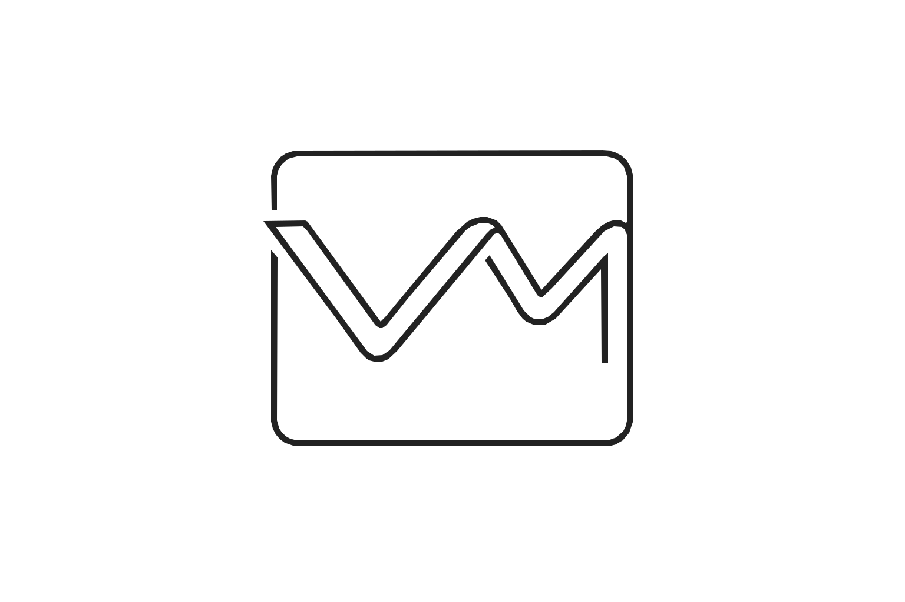
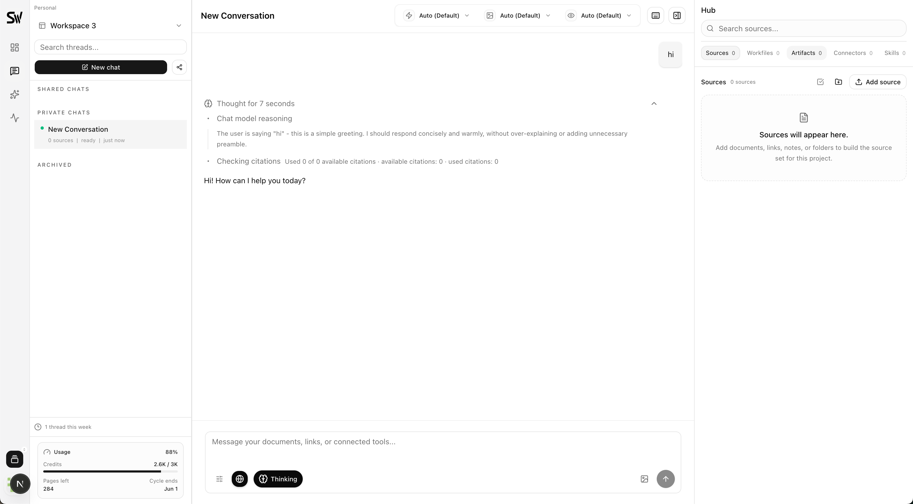

<div align="center">



# SourceWeft

**开源 NotebookLM 替代品：连接你的资料源，进行可信问答，生成带引用的多种内容，并通过 Virtual FS 和可扩展 Skills 增强深度知识工作。**

支持自托管与多模型，可汇聚文件、网页、笔记、YouTube 和 SaaS 连接器，让团队掌控数据、模型和知识工作方式。

[](LICENSE)
[](https://github.com/SourceWeft/SourceWeft/stargazers)

[English](README.md) | [简体中文](README.zh-CN.md)

</div>

---

**SourceWeft** 是面向深度知识工作的开源 NotebookLM 替代品。你可以把 PDF、网页、笔记、YouTube、Notion、Google Drive、Gmail、Slack 等资料汇聚到一个结构化资料空间中，并基于选定资料获得带引用、可验证的回答。

不止于问答，SourceWeft 还可以帮助你生成学习指南、FAQ、时间线、研究简报、草稿、音频概览、图像 Artifacts 等知识产物。Virtual FS、内置 Skills、自定义 Skills、Web 工具和工作文件，让 Agent 能够围绕你的资料读取、搜索、创作、整理和持续迭代。

<p align="center"></p>

---

## 使用场景

**研究简报。** 论文、网页和笔记 -> 带引用的研究简报，包含关键结论、证据和开放问题。

**学习指南。** 课程资料、视频和 PDF -> 学习指南、FAQ 和测验草稿。

**内容工作区。** 产品文档、网页和团队资料 -> 博客草稿、发布大纲和图像 Artifacts。

**团队知识。** Drive、Gmail、Slack、Notion 等连接资料源 -> 关于历史决策、项目上下文和共享知识的可追溯回答。

---

## 为什么选择 SourceWeft

**连接多种资料源。** 汇聚文件、URL、笔记、YouTube、结构化资料树和 SaaS 连接器。

**每个回答都可追溯。** 在选定资料中提问，获得带引用、可验证、基于来源的回答。

**给 Agent 一个真正的工作空间。** Virtual FS 将资料、工作文件、Artifacts 和 Skill 指令组织成可导航的上下文。

**用 Skills 扩展 Agent 能力。** 内置和自定义 Skills 可以提供可复用的领域方法、斜杠命令、工具默认配置和任务指导。

SourceWeft 支持自托管，可通过自己的 Model Gateway 路由对话、Embedding、重排序、图片和音频任务，并在团队中共享工作空间、角色、资料源和计费。

---

## 如何使用

1. **创建工作空间。** 从个人工作空间开始，也可以邀请团队成员进入共享工作空间，配置角色和共享计费。

2. **添加你的资料。** 上传文件、粘贴 URL、编写笔记、添加 YouTube 链接，或连接 Notion、Google Drive、Gmail、Slack 等工具。

3. **让 SourceWeft 完成索引。** 资料会被解析、切分、向量化，并通过混合检索变成可搜索的知识库。

4. **提问、创作、持续迭代。** 基于选定资料对话，生成带引用的内容，调用 Skills，搜索网页，创建 Artifacts，并在同一上下文里继续工作。

5. **随处继续。** 在网页端、桌面端或浏览器扩展中继续使用，同步你的资料、上下文和团队工作空间。

---

## Docker 自托管

如果你想直接使用已发布的容器镜像运行 SourceWeft，使用 Docker Compose。

```bash
git clone https://github.com/SourceWeft/SourceWeft.git
cd SourceWeft
cp docker/.env.example docker/.env
# 编辑 docker/.env——设置 MODEL_GATEWAY_ENCRYPTION_SECRET 和至少一个模型供应商密钥
docker compose -f docker/docker-compose.yml up -d
```

打开 **http://localhost:3000**，注册，开始使用。

---

## 贡献

Bug 报告、功能建议、代码和设计——都欢迎。  
参见 [CONTRIBUTING.md](CONTRIBUTING.md) 开始。

<a href="https://github.com/SourceWeft/SourceWeft/graphs/contributors">
  
</a>

## 社区

- 💬 **Discord** — [加入 Discord](https://discord.gg/KNqTGh2qrk)
- 🐛 **Issues** — [github.com/SourceWeft/SourceWeft/issues](https://github.com/SourceWeft/SourceWeft/issues)

## 许可证

[Apache License 2.0](LICENSE)
