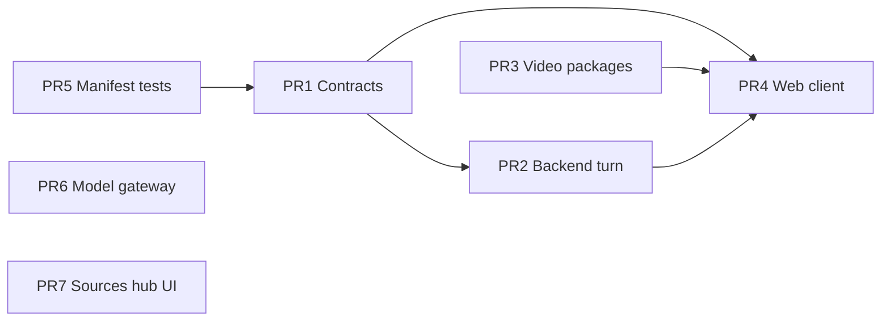

# Legacy Compat Recommended PR Split

The current branch mixes legacy compatibility cleanup with unrelated refactors. For easier review and safer rollback, prefer splitting into focused pull requests.

## PR 1 — Contracts and API hardening (merge first)

**Goal:** Reject legacy request shapes at the schema boundary; add contract tests.

**Include:**

- `packages/contracts/**`
- `packages/capability-contracts/**`
- `apps/backend/src/modules/invocations/registry.ts`
- `apps/backend/src/modules/threads/stream/threads.request-validation.test.ts` (route wiring only)
- `apps/backend/docs/legacy-compat-breaking-changes.md`

**Exclude:** UI, model-gateway, video worker, sources-hub.

## PR 2 — Backend turn path and metadata

**Goal:** Single canonical tool options path; preparer/model-settings fixes.

**Include:**

- `apps/backend/src/modules/threads/turn/**` (context, preparer, tool-selection, command-registry)
- `apps/backend/src/modules/threads/stream/input.ts`
- `apps/backend/src/modules/threads/model-settings.ts`
- `apps/backend/src/modules/threads/agent/turn/output-normalizer.ts`
- `apps/backend/src/modules/threads/agent/turn/tool-stream-handler.ts`
- Related `*.test.ts` under the above paths

**Ops note:** Run the metadata backfill SQL from [legacy-compat-breaking-changes.md](./legacy-compat-breaking-changes.md) if production `candidates > 0`.

## PR 3 — Video presentation package rename and worker

**Goal:** Replace `builtin-tool-generate-video-presentation` with the new package layout.

**Include:**

- `packages/builtin-tool-video-presentation/**`
- `packages/builtin-skill-video-presentation/**`
- `packages/video-presentation-runtime/**`
- Deletions under `packages/builtin-tool-generate-video-presentation/**`
- `apps/backend/src/worker/processors/video-presentation.ts`
- Worker/queue wiring in `apps/backend/src/modules/content/queue.ts`, `apps/backend/src/worker/main.ts`
- Dependency updates in `apps/backend/package.json`, `pnpm-lock.yaml`

## PR 4 — Web client alignment

**Goal:** Match canonical tool keys, stream body shape, and video ready UI.

**Include:**

- `apps/web/app/dashboard/chat/**` (tool-selection, streaming-request-body, message-normalizers)
- `apps/web/app/dashboard/chat/_components/artifact-preview/**` (if replacing sources-hub preview)
- `apps/web/lib/visual-deck/**` (if part of the same feature move)

**Exclude:** `model-gateway`, landing page, unrelated sidebar tweaks unless required for compat.

## PR 5 — Manifest sync tests (can stack with PR 1 or 3)

**Include:**

- `packages/builtin-*/tests/manifest.test.ts`
- `packages/builtin-skill-*/tests/**`
- Any manifest JSON/TS sync fixes those tests enforce

## PR 6 — Model gateway refactor (independent)

**Goal:** Adapter and routing changes unrelated to legacy compat.

**Include:**

- `packages/model-gateway/**`
- `apps/backend/src/shared/model-gateway/**`
- Any backend consumers updated only for gateway behavior

**Rationale:** Large diff (~745 LOC) with separate failure modes; do not block compat merges.

## PR 7 — Sources hub / artifact preview refactor (independent)

**Goal:** UI restructuring without changing compat contracts.

**Include:**

- Deletions under `apps/web/app/dashboard/chat/_components/sources-hub/**`
- `apps/web/app/dashboard/chat/_components/artifact-preview/**`

Verify feature parity (artifact preview, video presentation renderer, visual deck export) before merge.

## Merge order

PR 6 and PR 7 can merge in parallel with the compat stack when they do not touch the same files.
