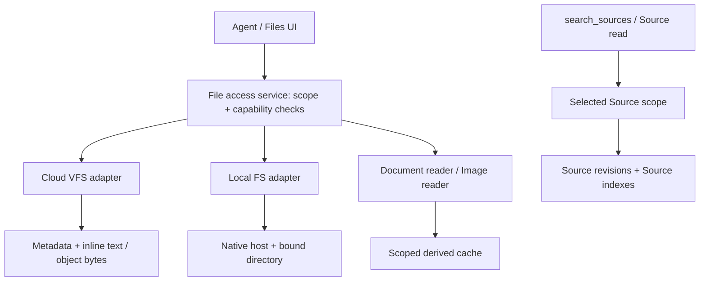

# Files, Sources, and scoped retrieval

日期：2026-09-10；2026-09-11 更新。状态：P1 实施中。

用户补充：产品尚未发布，不需要历史数据恢复或兼容层。新状态从明确默认值开始，旧接口/旧 payload 不提供兼容别名；数据库只执行新结构所需变更，不以此自动删除用户本地原件。

用户已确认方向：Cloud Files 使用 VFS，Local Files 使用真实 FS；图片通过视觉输入读取，文档按需解析。本文件补齐产品行为、检索边界、数据契约、权限与验收标准。所有用户界面名称保持英文。

配套计划：[Implementation plan](../plans/2026-09-10-files-sources-retrieval-plan.md)。

本设计替代 `2026-09-10-local-directory-files-design.md` 中独立 Files 入口、隐藏本地 Workfiles 的旧 UI 描述。保留其中本地目录绑定、文件落盘、禁止自动迁移、删除对话不删除目录等约束。Hub 独立窗口修复不属于本方案。

## 1. 产品决策

| 名称 | 定义 | 存储 | AI 权限 |
| --- | --- | --- | --- |
| Sources | 用户明确关联的参考资料 | Cloud 原件、Web 内容、本地只读引用 | Read / Search / Cite |
| Files | 当前任务直接使用的文件，包括原有文件和生成文件 | Cloud VFS 或 Local FS | Read / Search / Cite / Create / Edit，受任务授权限制 |
| Artifacts | 值得交付和集中预览的结果 | 引用实际文件或明确发布的版本 | Preview / Download / Revise |

- 面向用户的 `Workfiles` 改为 `Files`。公开文件路径/API 使用新 Files 契约，不保留 `/workfiles` 兼容别名。内部表名按实现需要调整，不作为旧接口兼容约束。
- `Working directory` 仅表示命令执行和相对路径的起点，持续显示在对话顶部及详情中。
- 文件被用于参考不改变分类，也不要求加入 Sources。Sources 的额外保证是 AI 不覆盖原文。
- Artifacts 不是第三个检索库；标记为结果不自动复制文件，不自动加入 Sources。已有公开发布流程继续创建明确的发布版本，不能因打开预览而上传本地文件。
- 本地执行不等于本地推理。模型、解析服务的数据处理位置和文件原件的存储位置分别呈现。

## 2. 用户路径

### Local

1. `Choose working directory` 或使用自动创建的任务目录。
2. 目录内原有文件和新增文件立即出现在 Files，保持真实目录结构。
3. 用户要求读取 PDF、检查图片或修改文档时，按需调用对应工具；无需再添加 Source。
4. 生成结果写回同一目录，可以从 Artifacts 快捷打开。
5. 需要受保护的额外参考资料时，通过 `Add source > Link local files or folder` 添加。

对话顶部显示 `My Mac · customer-project`。详情显示完整 Working directory、设备状态。设备和目录绑定沿用当前不可变规则；切换执行位置不属于本次迁移。

### Cloud

Files 显示 `Cloud · This conversation`，访问当前对话的 VFS。上传到 Files 的原件和 AI 生成文件按同一文件模型管理。Cloud 使用统一的文本/二进制文件模型。

Cloud sandbox 是执行设施，不自动成为持久 Files。已有明确的 prepare/collect 或发布流程继续负责传输；本方案不声称 VFS 和 sandbox 自动同步。用户可见的持久文件必须成功写入 VFS 后才能标记 Saved。

### Sources

`Add source` 提供 `Upload files`、`Link local files or folder`、`Add URL`、`Choose existing sources`。

- 新添加的 Source 默认选中；选择状态按对话保存。
- 项目共享资料以可见关联出现，不能成为隐藏范围。新增共享 Source 不自动加入已有对话的选择。
- 选择 Source folder 表示选择其授权范围内的后代，UI 显示数量；每轮固定展开后的集合，新文件在下一轮进入并显示变更提示。
- 本地 Source 标识 `My Mac · Read-only`。索引准备时说明原件留在本地，提取内容和索引在服务端保存，配置的解析/模型服务可能处理相关内容。选择本地工作目录本身不授权此类后台 Source indexing。
- 本地 Source 默认私人访问，不能仅靠共享对话或索引记录授予其他用户设备访问权限。远程访问沿用显式设备授权。

## 3. 检索边界：两条链路，禁止自动合并

### Source search

`search_sources` 仅接受服务端解析出的本轮 Sources 集合。模型可进一步缩小，不能扩大。BM25、向量检索、rerank、Source 原文读取、邻近片段和引用打开，都使用相同权限上下文。

范围计算：用户/组织权限 ∩ 对话关联 ∩ 已选择 Sources ∩ 可访问的当前版本。目录展开、mentions、历史引用和缓存不允许越过该集合。有效范围为空时返回 `NO_SOURCES_SELECTED`，不得表示整个 workspace。

Source 选择使用显式替换语义：省略字段表示使用持久化选择，`[]` 表示清空。不从历史消息恢复选择。mention 不隐式选择已排除的 Source；UI 的显式 `Use source` 操作可更新选择，文本中的名称只能缩小或请求澄清。

持久化到 `threads.source_selection_json`，结构为 `{ revision, selectedSourceIds }`；更新使用 expected revision 防止两个窗口互相覆盖。默认 revision=0、选择为空，没有 initialized 或历史初始化状态。客户端不得通过修改其他 chat preferences 覆盖该状态。Turn 请求只能缩小当前持久选择，不能用旧 sourceIds 扩大范围。

### File search

Files 的范围由服务端绑定的 Cloud thread VFS 或本地 device + root grant 决定。模型提供的相对路径或 glob 只能缩小该范围。

- `ls / glob`：文件和路径查找。
- `grep`：原始 UTF-8 文本搜索；二进制明确跳过并计入覆盖状态，不先解码成乱码。
- `read_file`：文本分页读取，非文本返回明确类型提示。
- `read_document`：指定文档、指定页/段/工作表范围的按需读取。
- `search_files`：显式指定 Files 内的路径集合或子目录，对文本及支持的文档执行有界内容搜索；复用文档解析结果，无全目录默认向量索引。
- `view_image`：读取指定图片或已有文档页面渲染，不提供全目录视觉语义检索。

现有工具对显式 `/kb` 路由的访问仍属于 Source read/search，受选中 Sources 限制；不会因工具名是 `grep` 就获得 Files 或 workspace 全域权限。根目录操作只能列出可用挂载点，禁止无差别跨挂载内容搜索。

`search_files` 第一版支持 literal / regex 内容查询；自然语言先由 Agent 明确转成查询词或文件范围，不能把关键词无命中描述成语义上不存在。每次结果带 exact request scope、visited/matched/skipped/failed、truncated 和 continuation 信息。完整范围内有失败或跳过时，coverage 必须是 partial。

### 任务路由

| 请求 | 允许的链路 |
| --- | --- |
| 根据选中的资料说明政策 | Source search / Source read |
| 在项目目录里找条款 | File search / read_document |
| 读取指定文件 | 直接读取，无须先检索 |
| 根据政策修改方案 | Sources 提供政策依据，Files 提供处理对象，分别调用、分别引用 |
| 比较 Sources 与目录中的合同 | 两条链路显式执行，保留来源，不将 Files 插入 Source 索引 |

UI 每个 Tab 搜索自己的内容：`Search sources…`、`Search files…`、`Search artifacts…`。列表默认搜索名称/路径；内容搜索是明确操作，不能将列表过滤宣称为全文检索。不设置跨 Sources 和 Files 的隐式 All 搜索。

Web search 是独立工具，按任务启用。任一链路失败或无结果都不得静默搜索另一边、Web 或更换模型/解析提供方。

检索隔离约束新工具输出，不承诺清除模型已读过的聊天内容。取消选择后，后续工具不再返回该 Source；需要全新上下文时创建新对话。

## 4. 文件访问结构

VFS 是文件接口及逻辑命名空间，不代表所有内容必须进入数据库。Local FS 不复制到 Cloud Files，不通过数据库代理保存完整目录。

统一文件描述包括：`scopeKind`、`backendKind`、`fileId`、`relativePath`、`name`、`mimeType`、`sizeBytes`、`revision`、`origin`、`capabilities`、`availability`。授权上下文由服务端补齐 tenant/workspace/thread/device/grant，不信任模型提交的这些字段。

- `scopeKind`: `files` 或 `source`。
- `backendKind`: `cloud_vfs` 或 `local_fs`。
- Cloud fileId 使用持久 ID；Local fileId 是绑定范围内的资源 ID，不能作为独立授权凭据。
- Local rename/delete 后旧路径引用可显示 moved/missing；第一版不靠 inode 或同名文件推断新的目标。
- `revision` 表示本次读取字节的内容指纹。mtime/size 可以作缓存提示，但不能单独证明引用内容没变化。
- `origin` 为可证实的 `user_provided` / `agent_created` / `external` / `unknown`，记录修改操作；不能把无法确认的本地文件猜成用户创建。
- Capabilities 分别声明 readText/readDocument/viewImage/searchText/write。当前 Cloud text-only 不得谎报 binary 能力。

沿用现有 `ls/glob/grep/read_file/write_file/edit_file`，新增 `read_document/search_files/view_image`。不为了统一界面重建现有 Deep Agents 工具栈；能力契约及两类存储 adapter 作为扩展点。

## 5. Cloud VFS 与 Local FS

### Cloud

对 `working_files` 做增量扩展：原 inline text 保留；新增 payload kind、object reference、content hash、revision、provenance 字段。inline text 与 object bytes 使用互斥约束，不能同一版本双写后随机选取。

数据字段：`payloadKind`（inline_text/object）、`storageBucket`、`storageKey`、`contentHash`、`revision`、`provenanceJson`。原 `contentText` 保留，object 模式下必须为空字符串；inline 模式不得有 object reference。空文本文件是合法 inline payload，不以空字符串判定存储类型。新文件写入时必须生成 hash 和 revision，不实现历史记录懒迁移。

二进制先上传暂存对象、检查 MIME/长度/hash，再事务提交 metadata 和 revision。失败清理孤立暂存对象。读取按 scope 授权，不返回可长期绕过鉴权的公开 URL。写入带 expectedRevision，冲突显式报错。

公开路径/API 统一使用 Files，不设置旧路径兼容层。旧 256 KiB 文本与每对话 200 文件限制不因改名暗中改变；binary 引入明确配置及总量配额，纳入存储计量。无法确认来源的文件 provenance 为 unknown，不伪造作者。

### Local

通过 native host 的绑定目录读取；list/search 在本机执行，返回有界结果，不为 grep 把整个目录上传到 backend。沿用 descriptor-relative 访问、链接/特殊文件限制和写入冲突检查。

当前 file.read 的 1 MiB 上限不能直接承担普通图片和文档。保留文本读取上限，新增独立 binary read session：每块最多 512 KiB，默认总文件上限 20 MiB，逐次鉴权、完成时校验 revision/hash，支持取消和超时；每个 transport 使用其自身更小的消息上限，Base64/JSON 开销计入计算。

分块是字节传输方式，不允许对同一次读取拼接不同文件版本。不得把 Base64 作为普通工具文本持久化或输出给模型。应用内 preview 与模型 image payload 共用授权读取，不共用不安全的公开地址。

## 6. 文档读取和内容缓存

复用 `builtin-document-parsers` 的解析能力，抽取不强依赖 Source record 的解析入口：输入授权 file bytes + revision + MIME + 已配置 parser policy，输出带定位信息的结构化内容。Source ingestion 与 File read 分别承担 scope、持久化和计费，不能通过创建虚假 Source 来读取 Files。

首版支持 UTF-8、PDF、DOCX、PPTX、XLSX/CSV。PDF 保留页码，PPTX 保留 slide，表格保留 sheet/cell，DOCX 保留 paragraph/heading；没有真实页码就不编造页码。

- 默认单次读取预算 50 个页面/slide 单元或 20,000 个提取文本字符，先到为准，返回 continuation 和真实 truncation。表格单次最多 1,000 个单元格，范围读取可继续。
- 搜索默认每次最多检查 100 文件、返回 100 命中、运行 30 秒；解析单文件硬超时 120 秒；一个对话最多并行 2 个解析任务。达到预算明确返回 partial/continuation，不宣称完整搜索。
- 只返回 OCR 提取的文字时不能声称已经理解图表。需要视觉内容时渲染指定页，并调用视觉读取。
- PDF 渲染优先复用已安装 pdfjs-dist；Office 的视觉页渲染依赖明确配置的转换器。转换器不可用时报告 capability unavailable，不自动装软件、换服务或假装完成视觉检查。
- 解析器、OCR、模型、计费身份在调用前固定。缺少依赖或提供方失败直接返回具体错误，不沿现有 parser 内部 fallback 分支悄悄改变方案。

Cache key = scope owner + resource identity + revision + parser/version/options。Local Files 的持久派生缓存保存在宿主应用数据目录，不放进工作目录；服务端仅处理本次必要内容，不建立 Local Files 的后台资料索引。Cloud Files 使用对话范围的私有 cache。

默认复用 backend 的现有解析 runtime：授权读取指定文件 → 显式配置的 parser → 返回结构化内容 → 通过 scope-bound cache RPC 保存到宿主。只传输当前任务请求的文件；缓存 RPC 不接受任意磁盘路径。此流程可能把文件内容传给 backend/解析提供方，UI 必须如实显示处理位置，不能称为全本地解析。若未允许所需的数据处理路径，返回不可用而非私自上传。

本地缓存默认 LRU 512 MiB、30 天过期。Cache hit 仍需检查授权和当前 revision。清理 cache 不删除文件。撤销 grant 后清理相关 cache。少量实际引用文本进入聊天历史，这是用户可见回答的一部分，不等于自动同步文件原件。

## 7. 图片读取

`view_image` 输入已授权的 FileRef 和可选 crop；校验真实 MIME、字节和解码像素限制。首版支持 PNG/JPEG/WebP，GIF 只支持明确标注的静态帧，不声称读取整段动画。默认图片输入上限 10 MiB、解码上限 40 MP，并与所选模型更严格限制取交集。

处理路径：

1. Agent 已选 chat model 支持工具图像结果时，由 runtime 将图片作为真正 image content 放入后续模型请求。
2. 不支持时，仅可使用产品已明确配置且对用户可见的 vision profile，作为独立 `view_image` 模型调用，返回结果标明 `Analyzed by <model>` 及文件引用。
3. 未配置这种视觉处理策略时返回 `VISION_UNAVAILABLE`。不得静默换 chat model、提供方，或把 OCR/描述当成主模型亲眼看到图片。

这两种路径是显式 capability policy，不是失败后的自动 fallback。重用现有 model gateway、GLOBAL/BYOK 权限、审计与计费；不因 key 存在激活 Provider，不借用其他身份的凭据。

视觉结果按文件 revision 标记，保留图像来源；描述属于模型解释，不标作逐字引文。独立图片的引用定位到图片，可带 crop；文档图像定位到原文档页。

文件搜索不默认具备视觉语义检索。查文件名可以直接 glob；查图片文字需要明确 OCR；查画面内容需要限定候选范围逐张查看。全目录视觉 embedding 和自动图像 caption 索引不在首版范围。

## 8. 引用与 Artifacts

扩展引用类型为 `source` / `file` / `web`，而不是为 File 伪造 sourceId 或 Source chunk。Source/Web/File 统一使用新引用契约，不增加旧格式兼容读取。

File citation 包含：授权作用域标识、fileId、引用时路径/名称、revision、locator、实际读取的 bounded excerpt、origin。locator 是 line/page/paragraph/slide/sheet-cell/image 的带类型结构。

- 引用由成功的授权 read/search/view 工具注册，模型不能仅凭路径或文件中的 `[citation:...]` 字符串创建有效引用。
- 保留工作文件内旧 Source 引用标记的防伪处理。启用 File citations 不意味着直接信任文件里的引用字符串。
- 引用内容证明“该版本文件写了什么”，不证明事实正确。AI 生成草稿的引用明确标识其来源。
- 打开引用时重新鉴权；revision 相同则定位当前原文，不同则显示 `File changed since cited` 和已保存引用片段。
- 首版不自动保存本地原文件的完整历史快照；没有旧原图就显示无法重现旧图像，不能展示当前图假装是旧图。
- 移除 Sources 选择不抹除既有消息。撤销文件权限后，原文和缓存打开都要拒绝；已发送消息如何删除沿用聊天数据管理规则，不声称远程擦除已看到的内容。
- Local Artifact 默认指向本地文件。分享需要明确发布成云端版本；用户未发布时不生成公开链接。

## 9. 本地只读 Sources

这是完整方案第二阶段，不是首轮 Files 多模态能力的前置条件。

- 新增 read-only Source grants，与 read/write working-directory grants 分开。API 不能把浏览器提交的绝对路径直接授权。
- 添加本地 Source 后，执行明确的 Source indexing，使用既有 Source revision/chunk 存储。原件留在设备，提取文本/索引按 Sources 的云端处理说明持久化。
- Source folder 的索引只遍历批准范围，沿用不跟随链接规则，排除依赖/缓存，显示实际覆盖。设备变更或文件更新后创建新 revision。
- 每次本地 Source 检索先验证设备、grant、访问资格和索引版本；设备离线或检测到变更时返回 unavailable/updating，不默用旧索引回答。正在读取的字节与检索 revision 必须一致。
- 原件只读覆盖文件工具与 shell。被加入只读 Sources 的路径即使处于 Working directory 内，本任务仍受只读限制；UI 标识 Read-only。修改请求另存 Files。
- Source policy 变化在轮次边界生效；运行中的命令需取消/排空后才能宣称新限制已生效。若宿主无法验证 shell 的只读隔离，则不启用该本地 Source 模式。
- 同一个目录不自动同时加入 Files 与 Sources；用户显式重复关联时去重身份和展示，并说明只读约束。

## 10. 当前代码与差距（2026-09-10）

| 当前模块 | 已有能力 | 本设计要求 |
| --- | --- | --- |
| `modules/working-files/service.ts` | Cloud text-only、256 KiB、200 文件 | 保留旧数据，增加 binary payload 和版本 |
| `threads/agent/working-files-backend.ts` | VFS read/edit/grep；清理不可引用标记 | File citations + 明确 provenance，不冒充 Sources |
| `builtin-vfs/src/filesystem-mounts.ts` | `/kb` 只读；Workfiles/sandbox 非引用 | 分开 Source evidence 与 File reference 能力 |
| `threads/turn/preparer.ts` | 从请求或历史恢复 Source 选择；图片附件视觉路径 | 区分 omitted/empty；为工具图片复用明确 capability policy |
| `builtin-retrieval` / `sources/retrieval-repository.ts` | Source BM25/vector/rerank | 全链路 scope；空集合不扩权；与 Files 隔离 |
| `devices/provider.ts` / `local_host/files.rs` | 本地授权目录读写、1 MiB file.read | native search、有界 binary transfer、版本验证 |
| `builtin-document-parsers` | 已有多种格式解析 | 不依赖 Source ingestion 的 scoped File reader |
| `citation-registry.ts` / 前端引用组件 | Source/Web 引用 | typed File refs、版本提示、图片引用 |
| `file-preview-dialog.tsx` / `local-files-panel.tsx` | 文本预览；有并行开发改动 | 复用最终 preview 能力，避免创建第二个预览实现 |

以上为检查到的基线，不是新增能力已完成的声明。当前 main 存在其他未提交的 preview、Hub、billing 和 native chrome 工作；实施前必须重新检查差异。

## 11. 交付范围与不做事项

Release A：Sources 选择边界修正；Files 命名与 FS/VFS contracts；有界文件查找与文本搜索；Cloud binary；图片读取；文档读取/搜索；File citations 与预览；现有 Sources 保持独立。

Release B：本地只读 Sources、明确 Source indexing、设备/权限/版本检查、shell 只读保护，以及本地/云端 Sources 一致 UI。

首版不做：全 Files 向量索引、全目录视觉检索、自动将 Files 导入 Sources、自动同步本地原件到云端、自动持久化 cloud sandbox、自动整理用户目录、完整本地版本控制。

## 12. 必须通过的验收

1. 同名、不同内容分别放在 Source、当前 Files、其他对话、未授权目录。Source search 只返回选定 Sources；File search 只返回当前指定 Files。
2. 明确清空 Sources 后，即使历史消息有选择、anchor 或引用，也不恢复历史检索范围。
3. 工作目录预存 PDF 无需成为 Source 即可按页读取/查找；无任何 Source record/chunk 产生。
4. 本地和 Cloud 图片均经真正视觉输入或明确 vision profile 分析；无视觉模型则明确失败，无纯文本 Base64 伪读取。
5. 大于 1 MiB 的允许图片/文档通过分块完成；取消、超限、版本变化不会留下错误完成状态。
6. 扫描 PDF、图表页、DOCX/PPTX/XLSX 的文字与定位可验证；不支持的视觉页面处理明确报告。
7. 外部修改文件后新检索读取新内容，旧引用显示变化；删除、离线和撤权均不返回误导性当前内容。
8. Agent edit 与真实 sandbox shell 都不能修改只读 Source；普通 Files 仍可按任务要求修改，多个对话共享目录的冲突不被覆盖。
9. 本地副本不写入 Cloud Files；生成文件不自动加入 Sources；Artifacts 不重复进入索引，预览不触发发布。
10. 新建 Cloud/Local 会话按同一契约运行，不包含历史选择恢复、旧引用兼容或旧接口别名；不会自动迁移或删除用户本地原件。

## 13. 参考依据

以下仅支持设计中的产品对比及公开接口能力，不将 API 文档等同于 ChatGPT 内部实现：

- [ChatGPT Projects and local folders](https://learn.chatgpt.com/docs/projects)
- [ChatGPT Image inputs](https://learn.chatgpt.com/docs/image-inputs)
- [OpenAI Images and vision](https://developers.openai.com/api/docs/guides/images-vision)
- [OpenAI File inputs](https://developers.openai.com/api/docs/guides/file-inputs)
- [NotebookLM Source import and original-file protection](https://support.google.com/gemininotebook/answer/16215270?hl=en)
- [NotebookLM selected Sources and citations](https://support.google.com/gemininotebook/answer/16179559?hl=en)
